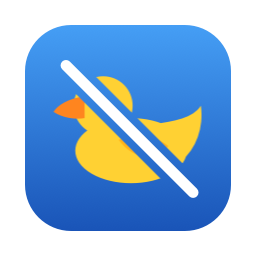
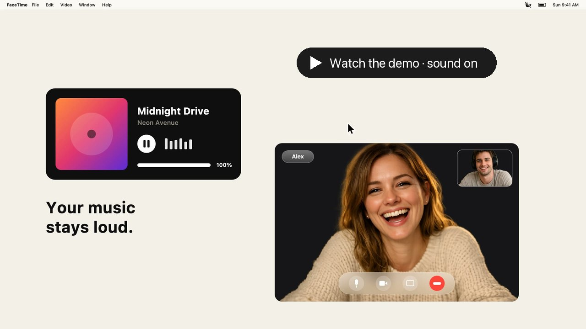

<p align="center"></p>

<h1 align="center">Duckproof</h1>

<p align="center"><b>Stop FaceTime from lowering your music and other apps on Mac.</b><br>
Free, open-source menu bar app that disables FaceTime audio ducking on macOS.</p>

<p align="center">
  <a href="https://github.com/iv2fi/duckproof/releases/latest"><b>⬇ Download for macOS</b></a> ·
  <a href="https://iv2fi.github.io/duckproof/">Website</a> ·
  <a href="https://iv2fi.github.io/duckproof/fr/">Version française</a> ·
  <a href="#faq">FAQ</a>
</p>

<p align="center"><a href="https://iv2fi.github.io/duckproof/#demo"></a></p>

---

## Sound familiar?

- *"Every time I start a FaceTime call, my music gets super quiet."*
- *"Other apps' volume drops during FaceTime on my Mac and I can't turn it off."*
- *"YouTube / Spotify / my game is almost silent while I'm on a call."*

That's **audio ducking**: during a FaceTime call, macOS automatically lowers the volume of every other app. There's no setting to turn it off. **Duckproof turns it off.**

## Features

- 🦆 **No more ducking.** Music, videos and games keep their volume during FaceTime calls.
- 🎵 **Your music never goes through Duckproof.** Only the call audio takes a detour, so music and videos keep their full quality, Spatial Audio and Dolby Atmos, with zero added latency.
- 🎚 **Or choose your own ducking.** Off by default, or lower other apps by 6, 12, 20 or 30 dB during calls, instead of Apple's all-or-nothing.
- 🔊 **FaceTime volume boost.** Up to 300%, with a soft limiter so voices don't crackle.
- 🎧 **Works with AirPods** and any headphones, speakers or audio interface.
- 🔔 **Setup tips when you need them.** If FaceTime, Zoom, Teams, Discord & co. are still lowering your other apps, Duckproof tells you where to fix it (or stays silent, your call).
- 🪶 **Zero CPU when you're not on a call.** No background polling: Duckproof sleeps until macOS signals that a call starts. Menu bar only, no Dock icon, starts at login.
- 🇫🇷 **English and French.**
- 🔓 **Free and open source** (GPL-3.0). No account, no tracking, no network access except an optional daily update check.

## Why Duckproof works this way

There are two ways to beat ducking. One is to capture every app's audio and re-play it at full volume, which means your music, videos and games all pass through a third-party app: possible delay, clipping, and spatial audio folded down to stereo. Duckproof does the opposite:

- **Only the call takes a detour.** Your music, videos and games play straight to your headphones, untouched: same quality, no added latency, Spatial Audio and Dolby Atmos still work.
- **Nothing to fight.** macOS still "ducks", but only on Duckproof's virtual output, where the only thing playing is the call. No undocumented tricks that a macOS update could break.
- **Lightweight.** Duckproof only processes audio while a call is on.

## How it works

macOS ducks other apps **on the audio device FaceTime is playing to**. Duckproof installs a small virtual audio device called *Duckproof*:

```
Before:  FaceTime ──► AirPods ◄── Music   (macOS lowers Music)
After:   FaceTime ──► Duckproof ──► AirPods ◄── Music   (nothing is lowered)
```

1. You set FaceTime's audio output to *Duckproof*, once.
2. Duckproof forwards the call audio to your real output (AirPods, speakers…) with about 20 ms of added latency.
3. Your other apps play straight to your headphones, so macOS has nothing to duck.

## Install

1. Download **`Duckproof-x.y.z.pkg`** from the [latest release](https://github.com/iv2fi/duckproof/releases/latest).
2. Open it. Duckproof is signed and notarized by Apple, so it installs like any other app. It adds Duckproof to Applications and installs its audio driver. **No restart needed.**
3. Duckproof opens, asks for microphone access ([why?](#why-does-duckproof-need-microphone-access)) and shows you the one FaceTime setting to change:
   **FaceTime › Video menu › Audio Output › Duckproof**

Requires **macOS 14.2 or later**, Apple Silicon or Intel.

## Settings

Click the 🦆 in the menu bar, or double-click Duckproof in Applications to open its settings window (handy if the icon is hidden by the notch, Bartender or Hidden Bar).

| Setting | What it does |
|---|---|
| **Duck Other Apps During Calls** | Off (default), or −6 / −12 / −20 / −30 dB on other apps while a call is on. Your volume comes back when the call ends. |
| **FaceTime Volume** | 100% (default) to 300%. Without ducking, music can feel louder than voices, so this helps. |
| **Send Call Audio To** | Follow the system output (default), or always use a specific device. |
| **Test Forwarding** | Plays a sound through Duckproof; you should hear it in your headphones. |

## FAQ

### Audio sounds muffled or like a phone call?

You're probably using your headphones' microphone over Bluetooth. When an app uses the mic of Bluetooth headphones (AirPods included), they have to switch to a "headset" mode that uses a low-quality codec, and **all** your audio goes mono and compressed, not just the call.

**Fix:** in FaceTime, open the **Video** menu › **Microphone** and pick another mic, such as your Mac's built-in microphone or your iPhone. Your headphones then stay in high-quality mode. FaceTime remembers this choice.

### Why does Duckproof need microphone access?

To stop FaceTime from lowering your other apps, Duckproof gives it its own virtual audio channel to play into. Duckproof then reads that channel and sends it to your headphones. macOS counts reading any audio channel as "using the microphone", even a virtual one, hence the permission. **Duckproof never listens to your real microphone.** The orange indicator only appears during calls.

### Does it work with Zoom, Discord, Teams, WhatsApp, Slack, Google Meet?

Yes, if the app lets you pick a speaker/output device: choose **Duckproof** in its audio settings. Duckproof forwards anything that plays into it, and if it sees Zoom, Teams, Discord, Slack, WhatsApp, Webex or a browser call lowering your other apps, it sends a notification telling you exactly where to change it. (Notifications can be turned off in the menu.)

### I can't hear FaceTime anymore

FaceTime is set to play into Duckproof, but Duckproof isn't running. Open Duckproof again (it normally starts at login), or switch FaceTime's audio output back to your headphones.

### Other apps still get quieter during calls

FaceTime's output isn't set to Duckproof yet. Go to **FaceTime › Video › Audio Output › Duckproof**. Duckproof sends a notification when it detects this.

### Is it safe?

Duckproof is fully open source: you can read every line or [build it yourself](#build-from-source). Its driver is built from [BlackHole](https://github.com/ExistentialAudio/BlackHole), a widely used open-source virtual audio driver. It doesn't collect anything; the only network request is the optional daily check for a new release on GitHub.

### Does it add latency?

About 20 ms, which you won't notice next to Bluetooth latency (150 ms or more).

### How do I uninstall it?

🦆 menu › **Settings…** › **Uninstall Duckproof…**, then move Duckproof.app to the Trash. Or by hand:

```bash
sudo rm -rf /Library/Audio/Plug-Ins/HAL/Duckproof.driver /Applications/Duckproof.app
sudo killall coreaudiod
```

## Build from source

You only need the Xcode Command Line Tools (`xcode-select --install`):

```bash
git clone --recursive https://github.com/iv2fi/duckproof.git
cd duckproof
./scripts/build.sh
```

This produces `build/Duckproof.app` and `build/Duckproof-1.0.0.pkg`, signed ad hoc for your own Mac. Official releases are built from the tagged commit with `scripts/release.sh`, which signs with a Developer ID certificate and notarizes with Apple.

For debugging, `/Applications/Duckproof.app/Contents/MacOS/Duckproof --diagnose` lists every audio device and which process is playing on which.

## Support

Duckproof is free and made by [V2F](https://www.youtube.com/@V2F). If it saved your calls, ⭐ **star the repo** (it helps other people find it) and check out the [YouTube channel](https://www.youtube.com/@V2F).

## License

[GPL-3.0](LICENSE). The virtual audio driver is built from [BlackHole](https://github.com/ExistentialAudio/BlackHole) by Existential Audio (GPL-3.0) and renamed, as its license requires for modified builds. Duckproof is not affiliated with or endorsed by Existential Audio or Apple. FaceTime is a trademark of Apple Inc.
